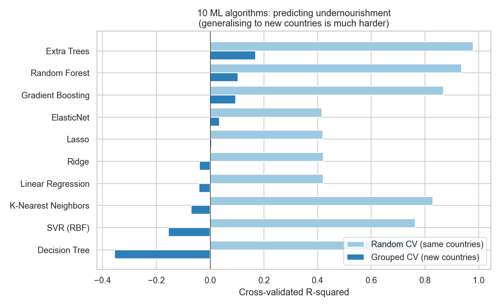

# Predicting Undernourishment in Africa, 10 ML Algorithms + Statistical Models

A machine-learning and statistical study of **food insecurity (undernourishment)**
across **49 African countries (2001-2023)**, built in Python from World Bank data.
It compares **ten ML algorithms** and backs the findings with classical
**inferential statistics** (regression with full inference, VIF, and a
mixed-effects panel model).

> **Headline insight (a lesson in honest evaluation):** with ordinary random
> cross-validation the best model looks excellent (R² ≈ 0.98), but that is
> leakage, because the same country appears in both train and test. Under
> **country-held-out (GroupKFold)** validation, R² drops to **~0.17**: predicting
> undernourishment for a country the model has never seen is genuinely hard,
> because levels are persistent and country-specific.

---

## 🔬 What the project does

**Machine learning, 10 algorithms compared**
Linear Regression, Ridge, Lasso, ElasticNet, K-Nearest Neighbors, SVR (RBF),
Decision Tree, Random Forest, Gradient Boosting, and Extra Trees, each evaluated
under **two validation designs** (random vs. country-grouped) to expose data
leakage, with **SHAP** explaining the best model.

**Statistics to support the findings**
- **Correlation analysis** of every determinant with undernourishment (with significance).
- **OLS multiple regression** with standardised coefficients, 95% CIs, p-values and a **VIF** multicollinearity check.
- **Mixed-effects panel model** (random intercept by country), the appropriate model for repeated country observations.



## 🔑 Key findings
- **Income is the dominant correlate**: higher GDP per capita is strongly associated with lower undernourishment (r = -0.55).
- **Water access, sanitation and health spending** are also strongly protective (r ≈ -0.5).
- **Higher fertility and agricultural employment** are associated with *more* undernourishment.
- These directions are consistent across the correlation, OLS and mixed-effects models.
- **But generalisation is limited** (grouped R² ≈ 0.17): cross-country determinants explain only part of the story; large country-specific effects (captured by the mixed model's random intercepts) dominate.

## 🗂️ Structure
```
africa-nutrition-ml/
├── 01_extract.py     # pull undernourishment + 12 determinants from the World Bank API
├── 02_analyze.py     # 10-algorithm ML comparison + correlation/OLS/mixed-effects stats + SHAP
├── data/africa_nutrition.csv
├── outputs/          # figures + metrics.json
└── report/           # comprehensive PDF report (with code)
```

## 📦 Data
World Bank Open Data: **prevalence of undernourishment** (% of population) plus 12
socio-economic, agricultural, health and demographic determinants, for African
countries, 2001-2023 (1,094 country-year observations). No API key required.

## 🔁 Reproduce
```bash
pip install pandas numpy scikit-learn statsmodels scipy shap matplotlib seaborn requests
python 01_extract.py && python 02_analyze.py
```

## ⚠️ Note
Country-level (ecological) analysis: relationships need not hold for individuals.
The data is observational, so results are associations, not causal effects. Some
predictors are collinear (max VIF ≈ 6.9), so individual pooled-OLS coefficients
should be read with care; the mixed-effects model is the more reliable for the
panel structure.

## 🧰 Tools
Python · scikit-learn · statsmodels · SHAP · pandas · matplotlib / seaborn · World Bank API

## 👤 Author
**Kingsley Amegah**, Health Data Scientist · GitHub: [@Kingsley-amg](https://github.com/Kingsley-amg)
